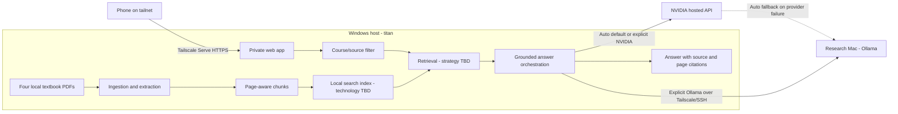

# Textbook RAG Context

## Objective

Build a question-answering pipeline for the user's Fall 2026 textbooks so course questions can be answered quickly from the assigned material.

The primary user is the student who owns this local workspace. The current request includes implementation, but product and architecture discovery is still in progress.

The product is a local web application on the Windows machine `titan`. It must remain private to the user's tailnet while being usable from the user's phone away from home through Tailscale Serve.

## Current State

The workspace contains source material but no application, repository history, configuration, or existing design system.

### Course and source inventory

| Course | Source | Pages | Extraction observation |
| --- | --- | ---: | --- |
| ITSC 1305 - Introduction to PC Operating Systems | `28143567.pdf` | 676 | Extractable with tuned `pdfplumber`; ten physical pages are blank/separator pages |
| ITSC 1305 - Introduction to PC Operating Systems | `CompTIA-Tech-FCO-U71-Study-Guide.pdf` | 363 | Visually intact; default extraction joins words, while `pdfplumber` with `x_tolerance=2` restores boundaries |
| INEW 2330 - Comprehensive Software Project: Planning & Design | `Clean Coder...pdf` | 247 | Emits malformed object/startxref warnings but extracts 246 text pages; physical page 1 is an image-only cover |
| ITSE 1311 and ITSE 2302 - Beginning and Intermediate Web Programming | `The Missing Link...pdf` | 303 | Extractable prose and code examples |

The two screenshots establish the Fall 2026 course list and LMS course identifiers. They are context, not textbook sources.

## Agreed Scope

- Ask natural-language questions about the semester textbook corpus.
- Build a working implementation after discovery, specification, and ticketing stabilize.
- Index only the four PDFs currently in the workspace for the first release. LMS slides, assignments, and other materials are not part of the current corpus.
- Preserve source identity and page coordinates through ingestion so answers can be traced back to the books.
- Generate answers only from retrieved textbook evidence. When the books do not support an answer, say that the corpus does not contain enough information rather than filling gaps from model knowledge.
- Offer `Auto`, `NVIDIA`, and `Ollama` provider choices for each query. `Auto` tries NVIDIA first and falls back to Ollama only when the NVIDIA request fails.
- Use Ollama on the Tailscale-reachable `research` Mac as the local fallback and explicit local provider.
- Reuse the user's existing NVIDIA-hosted API setup as the default provider in `Auto` mode.
- Bind the application to loopback on `titan` and expose it privately through Tailscale Serve; do not use Tailscale Funnel or another public ingress.
- Mount the application at `/textbooks` so the existing NVIDIA dialogue dashboard remains available at the Tailscale Serve root.
- Run the application and its Ollama SSH tunnel automatically on `titan`. It is acceptable for the app to be unavailable while `titan` is sleeping or powered off.
- Store conversation history locally on `titan` and provide a user-controlled deletion action.
- Use `qwen3-embedding:4b` for every query regardless of which generation provider answers, keeping one stable local retrieval index.
- Make every answer concise by default, with source/page citations and an expandable evidence area containing the retrieved textbook passages.
- Open citations inside the application at the exact original PDF page.
- Allow deletion of an individual conversation and deletion of all conversations after explicit confirmation.

## Constraints and Quality Risks

- PDF extraction quality differs by source. Ingestion must detect empty, malformed, and badly spaced pages instead of silently treating them as good text.
- Programming books contain code, headings, and tables that should not be flattened into misleading prose.
- One book is shared by two courses, while ITSC 1305 has two sources. Course filtering therefore cannot assume one book per course.
- `research` runs Ollama `qwen3.5:9b` for local generation and `qwen3-embedding:4b` for local embeddings. Live smoke tests produced the exact expected generation response and one 2,560-dimension embedding.
- Titan's current Tailscale Serve root proxies `http://127.0.0.1:8787`, the NVIDIA dialogue dashboard. The textbook app must use a distinct path or deliberately replace that route.
- NVIDIA's hosted APIs are for prototyping and their free availability and quotas can change. Sending textbook chunks to NVIDIA also crosses the local-only privacy boundary and therefore must be explicit.
- NVIDIA generation uses `nvidia/nemotron-3-super-120b-a12b` by default and remains environment-configurable. A live non-streaming smoke test returned the expected response.
- Retrieval uses a Titan-local SQLite catalog/FTS index plus a compact local semantic vector store populated through `qwen3-embedding:4b`; exact ranking thresholds are evaluation-tuned configuration, not provider-specific behavior.
- The textbooks may be copyrighted. The tool is for the user's private study corpus; distribution and public hosting are outside the current request unless explicitly added.

## Ubiquitous Language

- **Corpus**: the set of source documents currently indexed for questions.
- **Source**: one original textbook PDF, identified independently of any course.
- **Course**: a semester class that can reference one or more sources.
- **Physical page**: the one-based page index in the original PDF file used for viewer navigation.
- **Page label**: the book/PDF label shown to the reader and used in citation copy; it can differ from the physical page.
- **Chunk**: a retrievable passage derived from a source while retaining source and page metadata.
- **Citation**: an answer reference that identifies the source and original PDF page supporting a claim.
- **Ingestion**: extracting, cleaning, segmenting, embedding/indexing, and validating a source.
- **Retrieval**: selecting source chunks relevant to a question, optionally constrained by course or source.
- **Grounded answer**: an answer whose factual claims are supported by retrieved textbook passages.

## Living System Model

The editable architecture model is [Textbook RAG Architecture](https://www.figma.com/design/VOfLyXbC90Xz8TlyjfqkVD). The frame `Textbook RAG - System Boundary` (`2:2`) defines the agreed Titan, Research, NVIDIA, Tailscale, and public-internet boundaries. The Mermaid version below remains a repository-readable representation of the same model.

## Discovery Status

Discovery is closed. Remaining model tuning, retrieval thresholds, and numeric quality gates are implementation and evaluation work that must preserve the accepted behavior above.

## Visual Contract

The Figma architecture frame `Textbook RAG - System Boundary` (`2:2`) is the current visual contract for system ownership and trust boundaries. It has been visually validated with all three zones populated and no detected child overflow.

The product UI design is in the Figma `Product UI` page: desktop answer/evidence frame `7:3` and mobile auto-fallback frame `7:4`. The generated visual concepts and validated Figma renders are preserved under `design/`. Implementation must also cover empty, loading, insufficient-evidence, history deletion, clear-all confirmation, and exact-page citation-viewer states.
